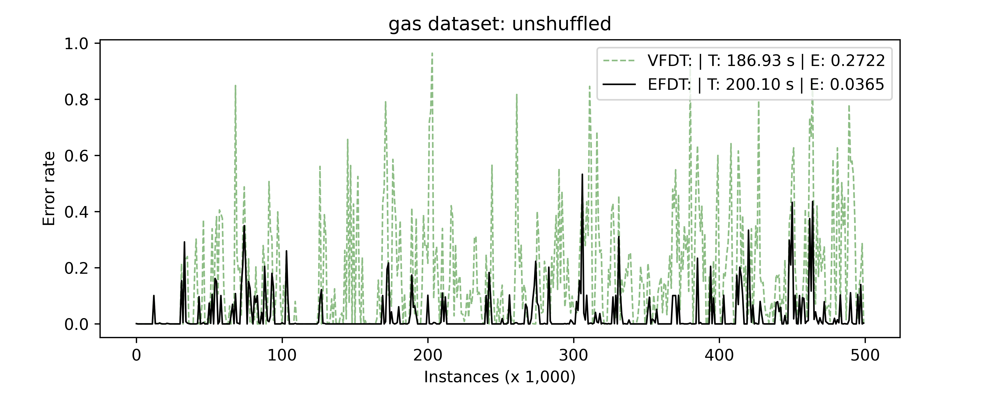

# **Incremental Decision Tree**: Reproducing Paper *Extremely Fast Decision Tree*

## Introduction


In this project, we reimplement the *Hoeffding Tree* and *Hoeffding Anytime Tree*, reproduce the experiments on UCI classification data sets and evaluate whether the conclusions from paper *Extremely Fast Decision Tree* are reproducible.

## Experiment Environment

Our implementation uses `python3` and the following packages are mainly required:

```
numpy
numba
tqdm
pyyaml
matplotlib
```
## Datasets

We compared VFDT and EFDT on 6 UCI classification dataset and one synthetic dataset.

Please refer to `dataset` directory.

## Quick Start: Mining on a dataset

You can execute `main.py` to quickly have a try mining specified data stream.

For example,

```bash
python main.py --dataset gas --tree v e --shuffle --verbose --plot
```

allow you to mining on [Gas sensors for home activity monitoring Data Set](http://archive.ics.uci.edu/ml/datasets/gas+sensors+for+home+activity+monitoring) using VFDT and EFDT respectively. 

Optional arguments:

- `--plot`: to plot error rate curves after mining
- `--verbose`: to print progress bar and information during mining

For details, run `python main.py -h`

## Reproducing Experiments

To reproduce our experiments, execute:

```
cd experiments
./exp_single_dataset.sh <dataset>
```

It may consume a long time (0.5~3h). After 22 runs(1 unshuffled stream and 10 shuffled streams for both VFDT and EFDT), `<dataset>_final_unshuffle.png` and `<dataset>_final_10_shuffled_average.png` will be saved in the same directory.

For example, here is `gas_final_unshuffle.png`: 



## References

1. Domingos, Pedro, and Geoff Hulten. "Mining high-speed data streams." KDD 2000. 
2. Hulten, Geoff, Laurie Spencer, and Pedro Domingos. "Mining time-changing data streams." KDD 2001.
3. Manapragada, Chaitanya, Geoffrey I. Webb, and Mahsa Salehi. "Extremely fast decision tree." KDD 2018.
4. Moshe Lichman. UCI Machine Learning Repository. 2013. http://archive.ics.uci.edu/ml

## Acknowledgement

We would like to thank Prof. Long and TAs for their devotion to ML Course.

## Contact

If you have any questions, please contact Qi Li: liqi17@mails.tsinghua.edu.cn.
